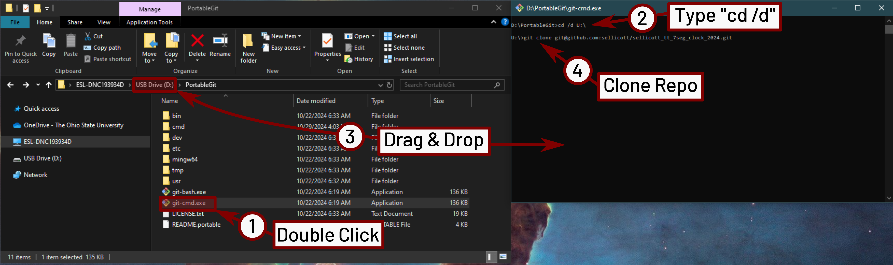

   

# 7-Segment LED Desk Clock
[!NOTE]
Example Project for Fall 2024 Columbus SSCS/CAS Tiny Tapeout Workshop
This is a demonstration Tiny Tapeout project for the workshop series held by the
[Columbus chapter of IEEE SSCS/CAS](https://r2.ieee.org/columbus-ssccas/blog/2024/01/14/tiny-tapeout-workshop-announcement/).

The goal of this project is to demonstrate the Tiny Tapeout flow starting from
a Verilog design to build a GDS file for manufacturing. 
- [Read the project documentation](docs/info.md)

## Project Description
Simple digital clock, displays hours, minutes, and seconds in a 24h format. The goal for the project is a simple demonstration of Verilog concepts while 
producing an interesting final project. The design is broken down into several components that should be filled in by workshop attendees.
These are tested using the provided testbenches for functionality, then assembled into the final design.

Since there are not enough output pins to directly drive a 6x
7-segment displays, the data is shifted out serially using an internal 8-bit shift register.
The shift register drives 6-external 74xx596 shift registers to the displays. Clock and control
signals (`serial_clk`, `serial_latch`) are also used to shift and latch the data into the external 
shift registers respectively. The time can be set using the `hours_set` and `minutes_set` inputs.
If `set_fast` is high, then the the hours or minutes will be incremented at a rate of 5Hz, 
otherwise it will be set at a rate of 2Hz. Note that when setting either the minutes, rolling-over
will not affect the hours setting. If both `hours_set` and `minutes_set` are pressed at the same time
the seconds will be cleared to zero.

# Local Simulation

This project can be locally simulated (including on Windows) using the [OSS-CAD-Suite](https://github.com/YosysHQ/oss-cad-suite-build/releases) from YosysHQ.
For instructions on setting up the tools, see [Open Source IC Resources](https://r2.ieee.org/columbus-ssccas/resources/open-source-ic-tools/) on the Columbus SSCS/CAS website.

[!CAUTION]
OSS-CAD-Suite must be installed to a path without spaces

## Clone the Git Repository
[!NOTE]
The following instructions are provided in order to use PortableGit.
If already familiar with git, proceed normally.

Once the tools are setup, clone this repository to the same directory that the tools are located.


Now that the tools are installed and this repository is cloned, the environment can be opened by running the [start.bat](start.bat) script.


## Testbench Simulation

Now, the various modules in the project can be simulated individually.
The following instructions describe the commands to simulate each included testbench. Run them by copy-pasting into the OSS CAD Suite terminal 
(setup by running [start.bat](start.bat))

[!NOTE]
The [start.bat](start.bat) script assumes that portable git is being used, and is installed in the same directory as `oss-cad-suite`. It also assumes that the git repository was cloned in the same folder as `oss-cad-suite`.
If this is not the case, modify the script accordingly.

In general, testbenches can be run with the following commands
```batch
iverilog -o sim\<testbench>.vvp test\<testbench>.v src\<verilog file 1>.v src\<verilog file 2>.v ...
vvp sim\<testbench>.vvp -fst
```
Then, assuming there were no errors during simulation, the result can be displayed using
```
gtkwave <testbench>.fst
```

### Commands for each testbench

* [clk_gen_tb](test/clk_gen_tb.v):
  ```batch
  iverilog -o sim\clk_gen_tb.vvp test\clk_gen_tb.v src\clk_gen.v
  vvp sim\clk_gen_tb.vvp -fst
  ```
  The following command shows the simulation output.
  ```batch
  gtkwave clk_gen_tb.fst
  ```
* [button_debounce_tb](test/button_debounce_tb.v): 
  ```batch
  iverilog -o sim\button_debounce_tb.vvp test\button_debounce_tb.v src\button_debounce.v src\clk_gen.v
  vvp sim\button_debounce_tb.vvp -fst
  ```
  The following command shows the simulation output.
  ```batch
  gtkwave button_debounce_tb.fst
  ```

## What is Tiny Tapeout?

Tiny Tapeout is an educational project that aims to make it easier and cheaper than ever to get your digital and analog designs manufactured on a real chip.

To learn more and get started, visit https://tinytapeout.com.

## Set up your Verilog project

1. Add your Verilog files to the `src` folder.
2. Edit the [info.yaml](info.yaml) and update information about your project, paying special attention to the `source_files` and `top_module` properties. If you are upgrading an existing Tiny Tapeout project, check out our [online info.yaml migration tool](https://tinytapeout.github.io/tt-yaml-upgrade-tool/).
3. Edit [docs/info.md](docs/info.md) and add a description of your project.
4. Adapt the testbench to your design. See [test/README.md](test/README.md) for more information.

The GitHub action will automatically build the ASIC files using [OpenLane](https://www.zerotoasiccourse.com/terminology/openlane/).

## Enable GitHub actions to build the results page

- [Enabling GitHub Pages](https://tinytapeout.com/faq/#my-github-action-is-failing-on-the-pages-part)

## Resources

- [FAQ](https://tinytapeout.com/faq/)
- [Digital design lessons](https://tinytapeout.com/digital_design/)
- [Learn how semiconductors work](https://tinytapeout.com/siliwiz/)
- [Join the community](https://tinytapeout.com/discord)
- [Build your design locally](https://www.tinytapeout.com/guides/local-hardening/)

## What next?

- [Submit your design to the next shuttle](https://app.tinytapeout.com/).
- Edit [this README](README.md) and explain your design, how it works, and how to test it.
- Share your project on your social network of choice:
  - LinkedIn [#tinytapeout](https://www.linkedin.com/search/results/content/?keywords=%23tinytapeout) [@TinyTapeout](https://www.linkedin.com/company/100708654/)
  - Mastodon [#tinytapeout](https://chaos.social/tags/tinytapeout) [@matthewvenn](https://chaos.social/@matthewvenn)
  - X (formerly Twitter) [#tinytapeout](https://twitter.com/hashtag/tinytapeout) [@tinytapeout](https://twitter.com/tinytapeout)
